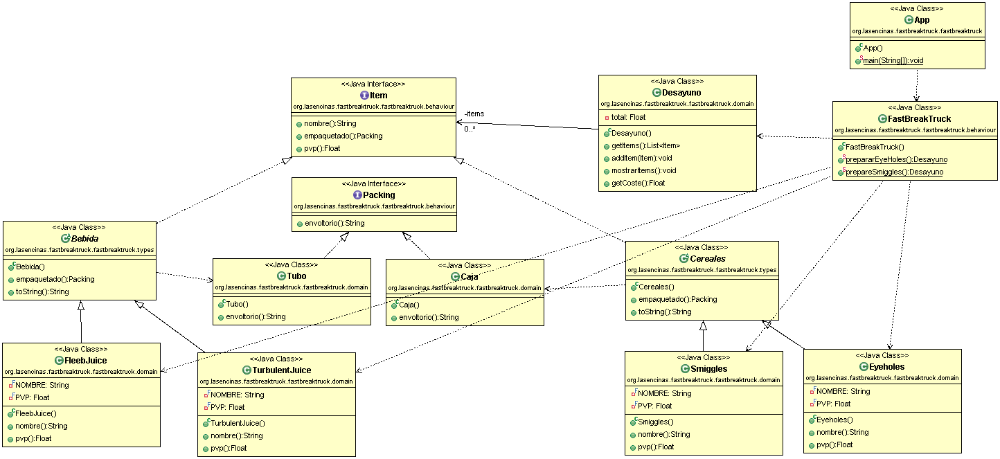

# FastBreakTruck
The FastBreakTruck Project is about to build an Application that let prepare two types of breakfast: Eyeholes + Turbulent Juice and Smiggles + Fleeb Juice, with their costs and one of them with a toy. This Project is from Kata of "Programación" subject

<!--Logos-->

## Tabla de Contenidos

1. [Salida de la Aplicación](#salidas-de-la-aplicacion)
1. [Diagrama UML](#diagrama-uml)
1. [Tecnologías Usadas](#tecnologias-usadas)
1. [Reflexiones](#reflexiones)
1. [Licencia](#licencia)

---

## Salida de la Aplicación

**[⬆ back to top](#tabla-de-contenidos)**

## Diagrama UML

**[⬆ back to top](#tabla-de-contenidos)**

## Tecnologías Usadas

- Java JDK 11
- Maven
- Visual Studio Code
- Git

**[⬆ back to top](#tabla-de-contenidos)**

---

## Reflexiones

### Que has mejorado con este proyecto?

**[⬆ back to top](#tabla-de-contenidos)**

---

## Licencia

MIT License

Copyright (c) 2021 Mateo Garcia Gonzalez

Permission is hereby granted, free of charge, to any person obtaining a copy
of this software and associated documentation files (the "Software"), to deal
in the Software without restriction, including without limitation the rights
to use, copy, modify, merge, publish, distribute, sublicense, and/or sell
copies of the Software, and to permit persons to whom the Software is
furnished to do so, subject to the following conditions:

The above copyright notice and this permission notice shall be included in all
copies or substantial portions of the Software.

**[⬆ back to top](#tabla-de-contenidos)**

---

## Autor
Mateo Garcia Gonzalez